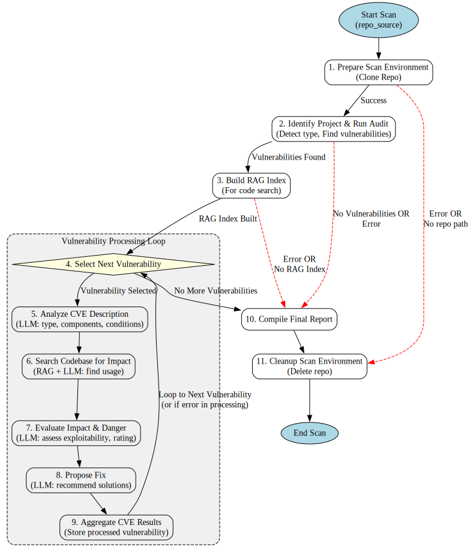

🎥 [Watch the Project Presentation Video](https://www.youtube.com/watch?v=BpzL04Wfg0c)

# AgentPimentBleu - Smart Security Scanner for Git Repositories

**Hackathon:** Gradio Agents & MCP Hackathon 2025  
**Track:** 3 - Agentic Demo Showcase  
**Tag:** agent-demo-track

## Overview

AgentPimentBleu is an AI-powered agent designed to intelligently scan Git repositories for security vulnerabilities. Unlike traditional scanners that often overwhelm users with numerous low-impact findings, AgentPimentBleu focuses on:

1. Detecting vulnerable dependencies and assessing their actual impact within the specific project's context
2. Filtering out noise from irrelevant CVEs
3. Providing actionable, prioritized security insights

The goal is to enable developers to focus on what truly matters for their security posture.

## Key Features

- **Intelligent Vulnerability Assessment**: Uses LLMs to understand CVE descriptions and determine real-world impact
- **Context-Aware Analysis**: Leverages RAG (Retrieval Augmented Generation) to search the codebase for actual usage of vulnerable components
- **Multiple Interfaces**: Offers both a user-friendly GUI (Gradio) and an API for CI/CD intelligentlygration
- **Comprehensive Reporting**: Provides detailed vulnerability reports with impact summaries and fix recommendations
- **Multi-Language Support**: Currently supports Python (requirements.txt, Pipfile, pyproject.toml) and JavaScript (package.json) projects

## Architecture

AgentPimentBleu is built with a modular architecture:

- **Core**: LangGraph-based agent orchestration for vulnerability analysis
- **Services**: Business logic for Git operations, dependency analysis, LLM interactions, and RAG
- **API**: FastAPI endpoints for programmatic interaction
- **UI**: Gradio interface for interactive use
- **Configuration**: External YAML-based configuration with environment variable support


*Agent workflow graph showing the orchestration of vulnerability scanning and analysis*

## Installation

### Prerequisites

- Python 3.10+
- Git
- Node.js and npm (for JavaScript project scanning)
- Ollama (optional, for local LLM support)

### Using pip

```bash
# Clone the repository
git clone https://github.com/briossant/AgentPimentBleu.git
cd AgentPimentBleu

# Install dependencies
pip install -r requirements.txt

# Create configuration
mkdir -p ~/.config/agentpimentbleu
cp agentpimentbleu/config/settings.yaml ~/.config/agentpimentbleu/
# Edit ~/.config/agentpimentbleu/settings.yaml to add your API keys
```

### Using Docker

```bash
# Clone the repository
git clone https://github.com/briossant/AgentPimentBleu.git
cd AgentPimentBleu

# Build the Docker image
docker build -t agentpimentbleu .

# Run the container with volume mounts for configuration and model cache
docker run -p 7860:7860 \
  -v ~/.config/agentpimentbleu:/root/.config/agentpimentbleu \
  -v ~/.cache/agentpimentbleu:/app/.cache/agentpimentbleu \
  agentpimentbleu
```

### Using Nix

```bash
# Clone the repository
git clone https://github.com/briossant/AgentPimentBleu.git
cd AgentPimentBleu

# Enter the Nix shell
nix develop

# Run the application
python main.py
```

## Usage

AgentPimentBleu can be used in three ways:

### 1. Gradio UI

```bash
python main.py
```

You can also explicitly specify the UI mode:

```bash
python main.py ui
```

This will start the Gradio web interface at http://localhost:7860, where you can:
- Enter a Git repository URL or local path
- View scan results with detailed vulnerability information
- See impact assessments and fix recommendations

### 2. FastAPI Server

```bash
python main.py api
```

This will start the FastAPI server at http://localhost:8000, with:
- API documentation at http://localhost:8000/docs
- Endpoint at `/scan/` for initiating scans

### 3. Command Line

```bash
python main.py scan --repo_source <URL_OR_PATH>
```

This will scan the specified repository and output the results as JSON.

## Configuration

Configuration is stored in `~/.config/agentpimentbleu/settings.yaml` with the following sections:

- `llm_providers`: Configuration for LLM providers (Gemini, Ollama)
- `dependency_parsers`: File patterns for identifying project types
- `rag_settings`: Configuration for the RAG system, including model cache directory

Environment variables prefixed with `APB_` can override configuration values.

### Model Caching

AgentPimentBleu caches models (including LLaMA models used by Ollama) to improve performance and reduce download times. The cache directory is configured in the `rag_settings` section of the configuration file:

```yaml
rag_settings:
  cache_dir: '/app/.cache/agentpimentbleu/models'  # For Docker
  # or
  # cache_dir: '~/.cache/agentpimentbleu/models'  # For local installation
```

When running with Docker, make sure to mount the cache directory as a volume to persist the models between container runs:

```bash
docker run -p 7860:7860 \
  -v ~/.config/agentpimentbleu:/root/.config/agentpimentbleu \
  -v ~/.cache/agentpimentbleu:/app/.cache/agentpimentbleu \
  agentpimentbleu
```

You can also override the cache directory using an environment variable:

```bash
export APB_RAG_SETTINGS__CACHE_DIR="/path/to/your/cache"
```

### Using .apbignore to Exclude Files from Analysis

AgentPimentBleu supports a `.apbignore` file that allows you to specify files and directories to exclude from analysis, particularly for RAG indexing. This is useful for large repositories with many irrelevant files or directories (like `node_modules` or build artifacts).

1. **Create a `.apbignore` file** in the root of your project directory:
   ```
   # Example .apbignore file
   # Ignore specific files
   app_secrets.py
   config.dev.yaml

   # Ignore directories
   temp_uploads/
   logs/

   # Ignore by pattern
   *.tmp
   *.bak

   # But don't ignore an important log!
   !important_audit.log
   ```

2. **Syntax**: The `.apbignore` file follows the same syntax as `.gitignore`:
   - Blank lines or lines starting with `#` are ignored
   - Standard glob patterns work (`*`, `?`, `[abc]`, `[a-z]`)
   - Patterns ending with `/` match directories
   - Patterns starting with `!` negate a previous pattern

3. **Default Ignores**: AgentPimentBleu automatically ignores common directories and files like:
   - Version control directories (`.git/`, `.hg/`, `.svn/`)
   - Package directories (`node_modules/`, `__pycache__/`, `venv/`)
   - Build artifacts (`build/`, `dist/`)
   - IDE files (`.idea/`, `.vscode/`)
   - Logs and temporary files (`*.log`, `temp/`)

Your patterns in `.apbignore` will be combined with these default patterns.

### Setting up Gemini API Key

AgentPimentBleu uses Google's Gemini API for LLM capabilities. You need to set up a valid API key to use this feature:

1. **Get a Gemini API Key**:
   - Visit [Google AI Studio](https://ai.google.dev/) and sign up or log in
   - Create an API key from the API section

> **Note**: If an invalid API key is provided, the agent will immediately stop processing and display an appropriate error message. This prevents wasting time on scans that would fail due to authentication issues.

2. **Configure the API Key** (choose one method):

   a. **Using the UI input box**:
   - When using the Gradio UI, you can enter your Gemini API key directly in the "Gemini API Key (Optional)" input box
   - This will override the API key in the configuration file for the current scan
   - This is useful for testing or when you don't want to modify the configuration file

   b. **Using the configuration file**:
   ```bash
   # Edit your configuration file
   nano ~/.config/agentpimentbleu/settings.yaml

   # Update the gemini section with your API key
   llm_providers:
     gemini:
       api_key: 'YOUR_ACTUAL_GEMINI_API_KEY'  # Replace with your actual API key
       model: 'gemini-2.0-flash'
   ```

   c. **Using environment variables**:
   ```bash
   # Set the environment variable
   export APB_LLM_PROVIDERS__GEMINI__API_KEY="YOUR_ACTUAL_GEMINI_API_KEY"

   # Or add it to your .bashrc or .zshrc for persistence
   echo 'export APB_LLM_PROVIDERS__GEMINI__API_KEY="YOUR_ACTUAL_GEMINI_API_KEY"' >> ~/.bashrc
   ```

   d. **For Docker**:
   ```bash
   # Pass the API key as an environment variable and mount volumes for configuration and cache
   docker run -p 7860:7860 \
     -e APB_LLM_PROVIDERS__GEMINI__API_KEY="YOUR_ACTUAL_GEMINI_API_KEY" \
     -v ~/.config/agentpimentbleu:/root/.config/agentpimentbleu \
     -v ~/.cache/agentpimentbleu:/app/.cache/agentpimentbleu \
     agentpimentbleu
   ```

## Example Projects

The repository includes example vulnerable projects for testing:

- `examples/python_example_vulnerable_project_1`: Python project with Werkzeug vulnerability
- `examples/javascript_example_vulnerable_project_1`: JavaScript project with lodash vulnerability

To scan an example project:

```bash
python main.py scan --repo_source examples/python_example_vulnerable_project_1
```

## Development

For detailed development information, see:

- [DOCUMENTATION.md](dev_context/DOCUMENTATION.md) for a detailed project explanation and requirements
- [ROADMAP.md](dev_context/ROADMAP.md) for the planned development roadmap

## License

[GNU General Public License v3.0](LICENSE)
